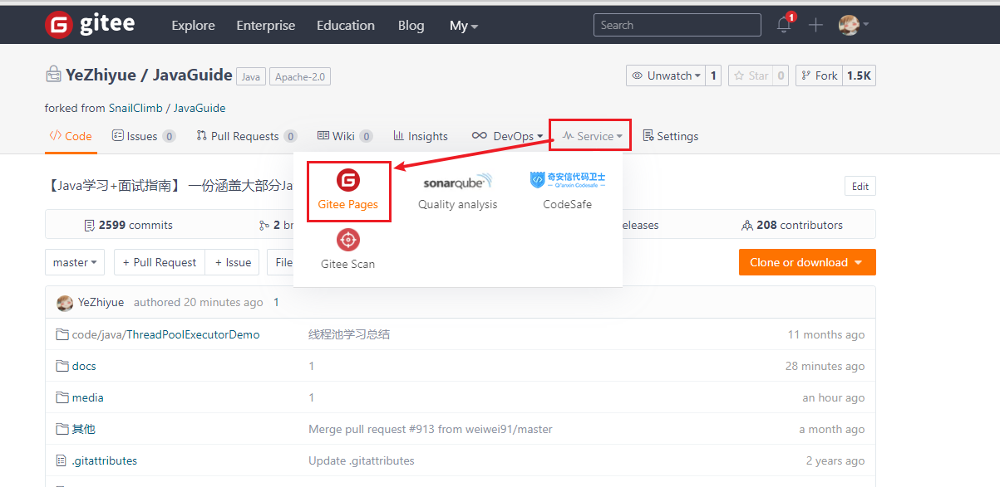
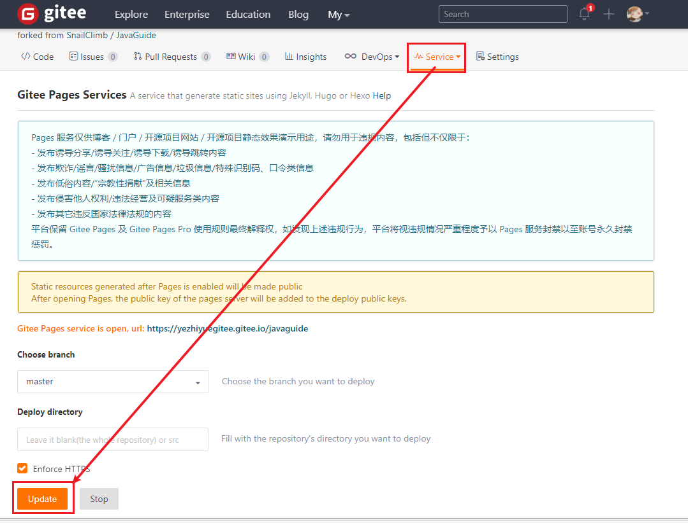

---

# 参考

Guide哥直达车

[https://mp.weixin.qq.com/s?__biz=Mzg2OTA0Njk0OA==&mid=2247486555&idx=2&sn=8486026ee9f9ba645ff0363df6036184&chksm=cea24390f9d5ca86ff4177c0aca5e719de17dc89e918212513ee661dd56f17ca8269f4a6e303&token=298703358&lang=zh_CN#rd](https://mp.weixin.qq.com/s?__biz=Mzg2OTA0Njk0OA==&mid=2247486555&idx=2&sn=8486026ee9f9ba645ff0363df6036184&chksm=cea24390f9d5ca86ff4177c0aca5e719de17dc89e918212513ee661dd56f17ca8269f4a6e303&token=298703358&lang=zh_CN#rd)

---

# 关键点快速起步

## 克隆示例代码

*<a href="#_top" rel="nofollow" target="_self">返回目录</a>*

```java
git clone https://github.com/Snailclimb/docsify-demo
```

## 安装我们的环境(需要有node.js)

*<a href="#_top" rel="nofollow" target="_self">返回目录</a>*

```java
npm i docsify-cli -g
```

## 启动我们的项目

*<a href="#_top" rel="nofollow" target="_self">返回目录</a>*

1.新建一个文件夹：mkdir docsify-demo

2.进入文件夹并运行 docsify 初始化命令：cd docsify-demo -> docsify init ./

3.然后访问：http://localhost:3000/

---

# 部署到我们的GiteePages

由于GitHub的Pages服务需要付费，这里选择国内的码云






